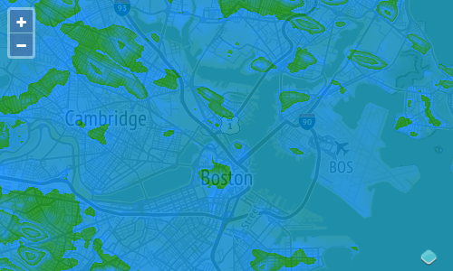

# Faire le rendu des données élévation

We're going to work with elevation data that is encoded in PNG tiles (see [the Mapbox post](https://blog.mapbox.com/global-elevation-data-6689f1d0ba65) on Terrain-RGB for more detail).  For this exercise, you'll need to [sign up for a Mapbox account](https://www.mapbox.com/signup/) and use your access token for tiles.

Add your default public token to `main.js`:

```js
const key = '<your-default-public-token>';
```

We want to manipulate the elevation data before rendering, but initially we'll add the Terrain-RGB tiles to the map just to see what they look like.  To do this, create an XYZ source with the Terrain-RGB URL and your access token.

[import:'elevation'](../../../src/en/examples/raster/elevation.js)

Next, create a tile layer that uses the elevation source.  Add this layer your map's `layers` array in `main.js`:

[import:'layer'](../../../src/en/examples/raster/elevation.js)

You should [now see]({{book.workshopUrl}}/) some oddly colored tiles shown over your base layer.  The elevation data in the Terrain-RGB tiles is encoded in the red, green, and blue channels.  So while this data isn't meant to be rendered directly, it is interesting to look at.


