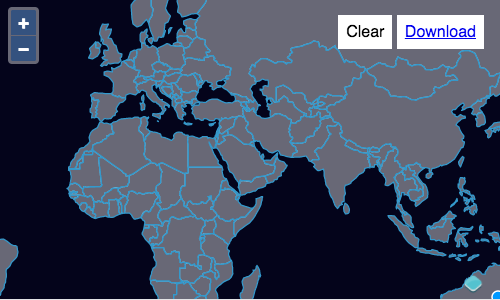

# Télécharger des objets géographiques

After uploading data and editing it, we want to let our users download the result.  To do this, we'll serialize our feature data as GeoJSON and create an `<a>` element with a `download` attribute that triggers the browser's file save dialog.  At the same time, we'll add a button to the map that let's users clear existing features and start over.

First, we need a bit of markup to represent the buttons.  Add the following elements below the `map-container` in your `index.html`:

[import:'markup'](../../../src/en/examples/vector/download.html)

Now we need some CSS to make the buttons look right.  Add something like this to the `<style>` element in `index.html`:

[import:'tools', lang:'css'](../../../src/en/examples/vector/download.html)

Clearing features is the easier part, so we'll do that first.  The vector source has a `source.clear()` method.  We want clicks on the "Clear" button to call that method, so we'll add a listener for `click` in our `main.js`:

[import:'clear'](../../../src/en/examples/vector/download.js)

To serialize our feature data for download, we'll use a `GeoJSON` format.  Since we want the "Download" button to work at any time during editing, we'll serialize features on every `change` event from the source and construct a data URI for the anchor element's `href` attribute:

[import:'download'](../../../src/en/examples/vector/download.js)

